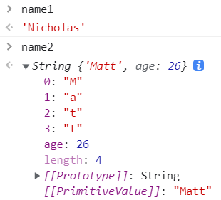
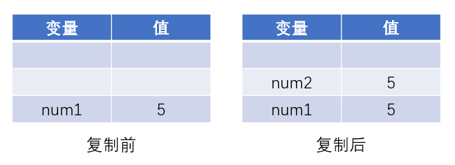
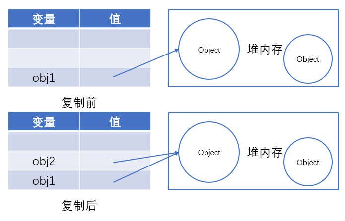

# 变量

## 原始值与引用值

**原始值（简单数据类型）：**JavaScript总共包含**6种**简单数据类型：`Undefined`、`Null`、`Boolean`、`Number`、`String` 和 `Symbol`。原始值是直接存储在栈中的简单数据段，也就是说，它们的值直接存储在变量访问的位置，我们可以直接**按值访问**。

**引用值（复杂数据类型）：**JavaScript中的引用值有很弱，如：`Object`、`Function`、`Array`等。由于引用值的大小会改变，所以不能将其存放在栈中，否则会降低变量查询速度，因此，其值存储在堆存储在堆中的对象，而放在变量的栈空间中的值是该对象存储在堆中的地址，也就是说，存储在变量处的值是一个指针（内存地址），指向存储对象的堆内存中。在操作对象时，实际上操作的是对该对象的引用（reference）而非实际的对象本身。所以，保存引用值的变量是**按引用访问**的。

## 动态属性

对于引用值而言，可以随时添加、修改和删除其属性和方法，所以引用值的大小会改变。比如，定义一个名为`person`的`Object`，并给其添加属性`name`，在这之后就能访问这个属性，直到`name`属性被删除或者`person`对象被销毁。

```javascript
let person = new Object();
person.name = "Nicholas";
console.log(person.name);	// Nicholas

// 删除name属性
delete(person.name);

// 销毁person对象，这里将person变量指向null，这样垃圾回收程序就会自动收回person之前指向的对象
person = null
```

那么给原始值添加属性会发生什么呢？

```javascript
// 非严格模式下，不会报错，但是无法给变量添加属性
let name = "Nicholas";
name.age = 27;
console.log(name.age);	// undefined
```

```javascript
// 在严格模式下，直接在添加变量的时候报错
"use strict";
let name = "Nicholas";
name.age = 27;	// TypeError: Cannot create property 'age' on string 'Nicholas'
```

这里注意原始值必须使用字面量声明，使用包装类的是行为类似原始值的对象！！！（这里详情可以看第五章）

```javascript
let name1 = "Nicholas";
let name2 = new String("Matt");
name1.age = 27;
name2.age = 26;
console.log(name1.age); // undefined
console.log(name2.age); // 26
console.log(typeof name1); // string
console.log(typeof name2); // object
```



## 值的复制

其实原始值和引用值的复制都是将栈中的内容复制，但是由于栈内存储的内容不同，原始值将内容完整复制一份，而引用值是将指针复制了一份，所以会出现一个改动其它全部都改动的现象。

```javascript
// 原始值的复制
let num1 = 5;
let num2 = num1;
```



```javascript
// 引用值的复制
let obj1 = new Object();
let obj2 = obj1;
obj1.name = "Nicholas";
console.log(obj2.name); // "Nicholas"
```



## 传递参数

JavaScript中的所有函数都是**按值传递参数**的，也就是使用了上面说的复制大法。

```javascript
// 传递一个原始值
function addTen(num) {
    num += 10;
}
let num = 20;
console.log(num);	// 20
addTen(num);
console.log(num);	// 20
```

```javascript
// 传递一个引用值
function setName(obj) {		// 这里obj复制了和person一样的指向
    obj.name = "Nicholas";	// 添加属性name
    obj = new Object();		// 这里obj换了一个新的指向
	obj.name = "Greg";		// 添加属性name，由于obj现在指向的对象与person不同，所以person指向的对象的name属性不变
}
let person = new Object();
setName(person);
console.log(person.name); 	// "Nicholas"
```

## 确定类型

### typeof

原始值可以使用`typeof`来判断数据类型。

```javascript
console.log(typeof undefined);				// undefined
console.log(typeof null);					// object
console.log(typeof true);					// boolean
console.log(typeof new Boolean(true));		// object
console.log(typeof 2);						// number
console.log(typeof new Number(2));			// object
console.log(typeof "hello");				// string
console.log(typeof new String("hello"));	// object
console.log(typeof Symbol());				// symbol
console.log(typeof {});						// object
console.log(typeof function(){});			// function
console.log(typeof []);						// object
```

### instanceof

`typeof`虽然对原始值很有用，但它对引用值的用处不大。如果要具体知道对象是属于哪一种类型，可以使用`instanceof`操作符。

`A instanceof B`用来判断A是否为B的实例。如果A是B的实例，则返回true，否则false。

> 原理：instanceof是检测原型。如果用instanceof 检测原始值，则始终会返回false，因为原始值不是对象。

用字面量的创建的字符串，数字，布尔，instanceof不能正确判断，如果被包装类实例化了就能判断了；用构造函数创建（包装类）的字符串，数字，布尔，既属于Object，又属于各自的类型，毕竟Object是个原型老祖宗。

```javascript
console.log(2 instanceof Number); 					// false
console.log(true instanceof Boolean); 				// false
console.log('str' instanceof String); 				// false

console.log([] instanceof Array); 					// true
console.log([] instanceof Object); 					// true
console.log(function(){} instanceof Function); 		// true
console.log(function(){} instanceof Object); 		// true
console.log({} instanceof Object); 					// true

console.log(new Number(2) instanceof Number);		// true
console.log(new Boolean(true) instanceof Boolean);	// true
console.log(new String('str') instanceof String);	// true
```

### constructor

使用constructor也可以判断数据类型，而且不论是由字面量创建的原始值还是包装类实例化的对象都能正确判断

> 原理：constructor就是检查实例的构造函数

```javascript
console.log((2).constructor === Number);					// true
console.log((new Number(2)).constructor === Number);		// true
console.log((true).constructor === Boolean);				// true
console.log((new Boolean(true)).constructor === Boolean);	// true
console.log(('hello').constructor === String);				// true
console.log((new Number('hello')).constructor === String);	// true
console.log(([]).constructor === Array);					// true
console.log((function() {}).constructor === Function);		// true
console.log(({}).constructor === Object);					// true

console.log((2).constructor === Object);					// false
console.log((true).constructor === Object);					// false
console.log(('str').constructor === Object);				// false
console.log(([]).constructor === Object);					// false
console.log((function() {}).constructor === Object);		// false
```

用costructor来判断类型看起来是完美的，然而，如果我创建一个对象，更改它的原型，这种方式也变得不可靠了

```javascript
function Fn(){};
Fn.prototype = new Array();

let f = new Fn();
console.log(f.constructor === Fn); 		// false
console.log(f.constructor === Array); 	// true
```

我的理解f就是实例1，new Array()创建了实例2，在f的原型对象找constructor属性，f的原型对象是实例2，所以在实例2的原型对象找constructor属性，结果是Array构造函数

### Object.prototype.toString.call()

这种方式能精准地得到数据类型

```javascript
let a = Object.prototype.toString;
console.log(a.call(2));						// [object Number]
console.log(a.call(new Number(2)));			// [object Number]
console.log(a.call(true));					// [object Boolean]
console.log(a.call(new Boolean(true)));		// [object Boolean]
console.log(a.call('hello'));				// [object String]
console.log(a.call(new String('hello')));	// [object String]
console.log(a.call([]));					// [object Array]
console.log(a.call(function(){}));			// [object Function]
console.log(a.call({}));					// [object Object]
console.log(a.call(undefined));				// [object Undefined]
console.log(a.call(null));					// [object Null]
```

# 执行上下文和作用域

变量或函数的上下文决定了它们可以访问哪些数据，以及它们的行为，这个概念在 JavaScript 中非常重要。每个上下文都有一个关联的**变量对象**，而这个上下文中定义的所有变量和函数都存在于这个对象上。

全局上下文是最外层的上下文，在浏览器中全局上下文就是我们常说的 window 对象（在 node.js 环境中就不是window了），也就是说window就是全局上下文关联的变量对象，所有通过 var 定义的全局变量和函数都会成为 window 对象的属性和方法。

使用 let 和 const 的顶级声明不会定义在全局上下文中，但在作用域链解析上效果是一样的。上下文在其所有代码都执行完毕后会被销毁，包括定义在它上面的所有变量和函数（全局上下文在应用程序退出前才会被销毁，比如关闭网页或退出浏览器）。

举个例子：
我国有两个城市——北京和上海，函数Beijing和函数Shanghai定义在China中，他们的上下文都是China，可以互相调用。
而作用域就是一个变量或者函数能起作用的区域，比如定义的person变量，它的作用域就是China函数的范围，在China函数外围就无法访问到person变量。

```javascript
function China() {
	console.log(person);	// 暂时性死区，ReferenceError: Cannot access 'person' before initialization

    function Beijing() {
        console.log('beijing');
        console.log(person);
    }
    
	function Shanghai() {
        console.log('shanghai');
        console.log(person);
    }
    
    let person = 'ZhangSan';
}

console.log(person);	// ReferenceError: person is not defined
```

但是虽然作用域是在China函数的整个范围，但是在声明变量之前是不能使用的，这就叫做**暂时性死区**，但是如果person变量是使用 var 声明的，这种行为就会由于变量提升而合法化。所谓**变量提升**，就是使用 var 声明的变量通通会放在作用域的最前面声明，不管你代码是写在哪里声明的。

当访问一个变量时，首先在当前的局部上下文查找，如果没找到该变量则进入上一层局部上下文，直到全局上下文。比如在Beijing函数中打印了person变量，Beijing函数中没有定义该变量，那么就进入China的上下文寻找。

## var、let 与 const

### var

var的作用域是函数作用域，在函数中使用 var 声明的变量，作用域只存在于该函数中，如果在函数中没有声明变量就进行了初始化，那么该变量就会自动被添加到全局上下文。

```javascript
function add(num1, num2) {
    var sum = num1 + num2;
    return sum;
}
let result = add(10, 20); // 30
console.log(sum); // 报错：sum 在这里不是有效变量
```

```javascript
function add(num1, num2) {
    sum = num1 + num2;
    return sum;
}
let result = add(10, 20); // 30
console.log(sum); // 30
```

### let

let的作用域是块级作用域，凡是用`{}`括起来的区域，在里面使用 let 声明的变量的作用域就是`{}`括起来的区域，而且 let 不能对一个变量进行声明二次声明

```javascript
{
    let d;
}
console.log(d); // ReferenceError: d 没有定义
```

```javascript
var a;
var a;
// 不会报错
{
    let b;
    let b;
}
// SyntaxError: 标识符b 已经声明过了
```

### const

const 基本上与 let 的用法一致，只是由 const 声明的变量的值不能进行修改，这里注意对于引用值来说，也就是栈空间中存储的指针不能更改，对象里面的内容还是可以改的。

```javascript
const o1 = {};
o1 = {}; // TypeError: 给常量赋值

const o2 = {};
o2.name = 'Jake';
console.log(o2.name); // 'Jake'

// 如果想让整个对象都不能修改，可以使用Object.freeze()，这样再给属性赋值时虽然不会报错，但会静默失败，严格模式下会直接报错
const o3 = Object.freeze({});
o3.name = 'Jake';
console.log(o3.name); // undefined
```

# 垃圾回收

## 标记清理法

标记清理法分为**标记**和**清理**两个阶段。标记阶段即为所有活动对象做上标记，清理阶段则把没有标记（也就是非活动对象）销毁。

- 垃圾收集器在运行时会给内存中的所有变量都加上一个标记，假设内存中所有对象都是垃圾，全标记为0
- 然后从各个根对象开始遍历，把不是垃圾的节点改成1
- 清理所有标记为0的垃圾，销毁并回收它们所占用的内存空间
- 等待下一轮垃圾回收

## 引用计数法

引用计数法顾名思义，就是记录变量被引用的次数。把对象是否不再需要简化定义为对象有没有其他对象引用到它，如果没有引用指向该对象（零引用），对象将被垃圾回收机制回收

- 当声明了一个变量并且将一个引用类型赋值给该变量的时候这个值的引用次数就为 1

- 如果同一个值又被赋给另一个变量，那么引用数加 1
- 如果该变量的值被其他的值覆盖了，则引用次数减 1
- 当这个值的引用次数变为 0 的时候，说明没有变量在使用，这个值没法被访问了，回收空间，垃圾回收器会在运行的时候清理掉引用次数为 0 的值占用的内存

```javascript
function test(){
    let A = new Object()
    let B = new Object()

    A.b = B
    B.a = A
}
```

存在的问题：循环引用。对象 A 和 B 通过各自的属性相互引用着，按照上文的引用计数策略，它们的引用数量都是 2，但是，在函数 test 执行完成之后，对象 A 和 B 是要被清理的，但使用引用计数则不会被清理，因为它们的引用数量不会变成 0，假如此函数在程序中被多次调用，那么就会造成大量的内存不会被释放。

再用标记清除的角度看一下，当函数结束后，两个对象都不在作用域中，A 和 B 都会被当作非活动对象来清除掉，相比之下，引用计数则不会释放，也就会造成大量无用内存占用，这也是后来放弃引用计数，使用标记清除的原因之一。

**优雅的代码书写提高代码性能**

1. 解除引用
   其实就是把不用的变量置null，解除变量的引用不仅可以消除循环引用，而且对垃圾回收也有帮助。

2. 使用 let 和 const 声明变量
   let 和 const 声明的变量是块级作用域，相比于 var 的变量提升和函数作用域，能更早地变为非活动对象被回收

3. 警惕内存泄露

   ```javascript
   // 这里name没有使用关键字声明就初始化了，那么就会自动被添加到全局上下文，作为window的属性。如果window不销毁，name就会一直存在
   function setName() {
       name = 'Jake';
   }
   ```

   ```javascript
   // 定时器也可能会悄悄地导致内存泄漏，只要定时器一直运行，那么name变量就会一直被引用
   let name = 'Jake';
   setInterval(() => {
       console.log(name);
   }, 100);
   ```

   ```javascript
   // 闭包造成内存泄露，只要返回的函数存在，那么name变量就不会被清除
   let outer = function() {
       let name = 'Jake';
       return function() {
           return name;
       };
   };
   ```

4. 静态分配与对象池

   ```javascript
   // 调用这个函数会在堆上创建一个新对象，然后修改它，最后再把它返回给调用者。
   // 如果这个对象的生命周期很短，那么它会很快失去所有对它的引用，成为可以被回收的值。
   // 假如这个函数频繁被调用，那么垃圾回收调度程序会发现这里对象更替的速度很快，从而会更频繁地安排垃圾回收。
   function addVector(a, b) {
       let resultant = new Vector();
       resultant.x = a.x + b.x;
       resultant.y = a.y + b.y;
       return resultant;
   }
   
   // 比起上述的函数定义方法，可以使用一个在函数外部定义的对象
   function addVector(a, b, resultant) {
       resultant.x = a.x + b.x;
       resultant.y = a.y + b.y;
       return resultant;
   }
   ```

   静态分配需要在别的地方声明对象resultant，而对象池就可以解决这个问题，对象池相当于共享对象，在需要的时候拿一个出来用，不用了就还回去。

   ```javascript
   // vectorPool 是已有的对象池
   let v1 = vectorPool.allocate();
   let v2 = vectorPool.allocate();
   let v3 = vectorPool.allocate();
   v1.x = 10;
   v1.y = 5;
   v2.x = -3;
   v2.y = -6;
   addVector(v1, v2, v3);
   console.log([v3.x, v3.y]); // [7, -1]
   vectorPool.free(v1);
   vectorPool.free(v2);
   vectorPool.free(v3);
   // 如果对象有属性引用了其他对象
   // 则这里也需要把这些属性设置为null
   v1 = null;
   v2 = null;
   v3 = null;
   ```